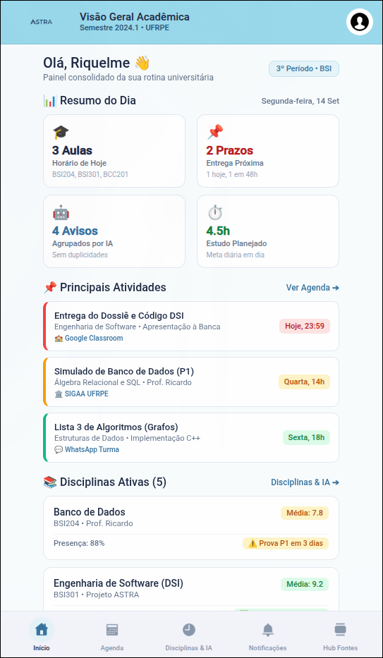

# 🚀 ASTRA - Ambiente de Suporte à Trajetória e Rotina Acadêmica
<div align='center'>

[](https://reactnative.dev/)
[](https://www.typescriptlang.org/)
[](https://firebase.google.com/)

</div>

## 📖 Sobre o projeto

O **ASTRA (Ambiente de Suporte à Trajetória e Rotina Acadêmica)** é uma aplicação mobile voltada à centralização e organização das informações acadêmicas de estudantes universitários.

A proposta é reunir, em um único ambiente, informações como conteúdos de disciplinas, atividades, materiais, avaliações, prazos, eventos e comunicados, que podem estar distribuídos entre diferentes plataformas e canais de comunicação.

O projeto é desenvolvido no contexto acadêmico e contempla, além da aplicação mobile, uma etapa de análise de dados e a elaboração de documentação científica.

A etapa de análise de dados pode ser encontrada no seguinte repositório: [*Análise de Dataset*](https://github.com/BrunoFellype/pisi3)


## 🎯 Objetivo

Facilitar o acompanhamento da rotina acadêmica por meio da centralização e organização das informações relacionadas às disciplinas e às demandas acadêmicas dos estudantes.

## ✨ Funcionalidades

Atualmente, o projeto contempla:

- 🔐 Cadastro de usuários;
- 🔑 Autenticação por e-mail e senha;
- 🔵 Autenticação com Google;
- 🏠 Tela inicial;

> Existem funcionalidades que ainda estão em desenvolvimento.

## 📱 Interface

<p align="center">
  
  
  
</p>

## 🛠️ Tecnologias

- **React Native** — desenvolvimento da aplicação mobile;
- **TypeScript** — linguagem utilizada no desenvolvimento;
- **Expo** — ferramentas para desenvolvimento e build da aplicação;
- **Firebase Authentication** — autenticação dos usuários;
- **Cloud Firestore** — armazenamento dos dados da aplicação;
- **Google Sign-In** — autenticação utilizando contas Google.

## ⚙️ Pré-requisitos

Para executar o projeto localmente, é necessário ter instalado:

- **Node.js**
- **npm**
- **Andorid SDK** ( *Caso deseje executar no Android* )
- **ADB** ( *Caso queira executar em um dispositivo físico* )

Para desenvolvimento utilizando Expo Go:

- Aplicativo **Expo Go** instalado no dispositivo

Para funcionalidades que utilizam código nativo, como o Google Sign-In:

- **Development Build do ASTRA**

## 🚀 Como executar

1. Clone o repositório
```bash
git clone https://github.com/BrunoFellype/dsi.git
cd dsi
```
2. Instale as dependências
```bash
npm install
```
3. Inicie o projeto
```bash
npx expo start
```

### 📱 Android
Para executar em um dispositivo Andorid com o ambiente nativo configurado:
```bash
npx expo run:andorid --device
```
> Funcionalidades que exigem código nativo podem necessitar de uma Development Build

## 🔥 Configuração do Firebase
O projeto utiliza Firebase para autenticação e armazenamento de dados.

Os arquivos de configuração que contenham informações específicas do ambiente não devem ser versionados no repositório.

Consulte a configuração de desenvolvimento do projeto antes de executar funcionalidades que dependam do Firebase.

